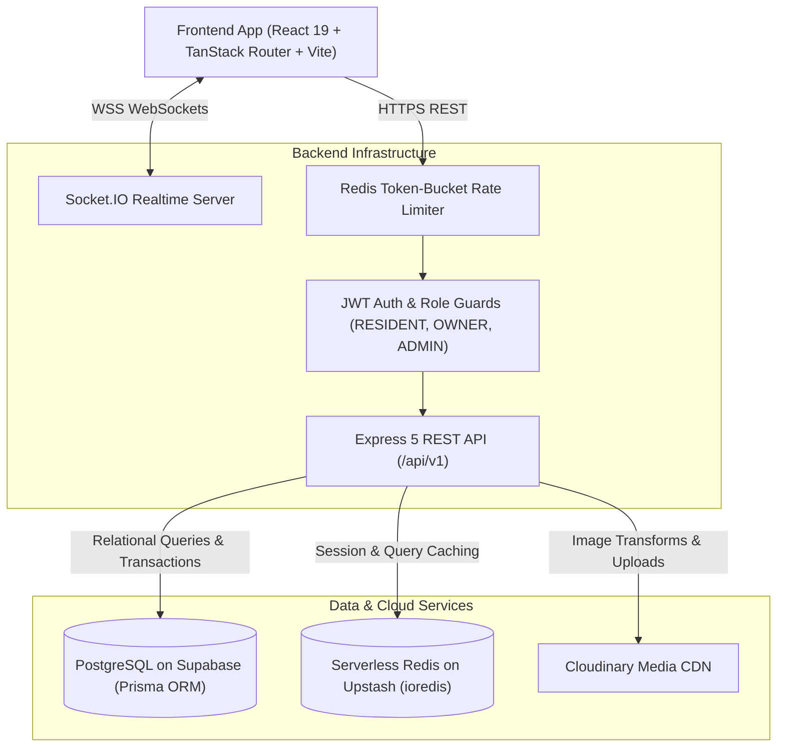

# 🏠 Roomzly — Full-Stack Rental & Real Estate Marketplace

[](https://www.typescriptlang.org/)
[](https://react.dev/)
[](https://expressjs.com/)
[](https://www.prisma.io/)
[](https://supabase.com/)
[](https://upstash.com/)
[](https://tailwindcss.com/)
[](https://socket.io/)

> **Roomzly** is a production-grade, full-stack rental marketplace engineered for finding and managing rooms, flats, student PGs, luxury apartments, and commercial listings. Built with a modern monorepo architecture featuring real-time chat, date-conflict-safe reservations, geo-spatial search, owner analytics, and comprehensive admin moderation.

---

## 🔗 Live Deployments & Endpoints

| Component | Status | Production Link |
| :--- | :--- | :--- |
| **Backend API** |  | [`https://roomzly-backend.onrender.com`](https://roomzly-backend.onrender.com) |
| **API Healthcheck** |  | [`https://roomzly-backend.onrender.com/health`](https://roomzly-backend.onrender.com/health) |
| **Ready & DB Probe** |  | [`https://roomzly-backend.onrender.com/ready`](https://roomzly-backend.onrender.com/ready) |
| **Sample Endpoint** |  | [`https://roomzly-backend.onrender.com/api/v1/properties`](https://roomzly-backend.onrender.com/api/v1/properties) |

---

## 🌟 Key Highlights & Features

### 🔍 1. Discovery & Search Experience
* **Multi-Facet Search:** Filter by city, locality, budget range, property category (PG, Flat, Studio, Villa), furnishing type, and verified badge.
* **Interactive Geo-Maps:** Visualized property discovery powered by Leaflet and OpenStreetMap.
* **Student Hub Landings:** Dedicated SEO-optimized pages for college campuses (UPES, Graphic Era, etc.) and regional student hubs (Prem Nagar, Dehradun).
* **Comparison & Wishlist:** Side-by-side multi-property comparison matrix and persistent user wishlist synced across devices.

### 🛡️ 2. Trust, Safety & Verification Engine
* **Verified Badges:** Identity document submission workflow for property owners and individual listings.
* **Admin Review Portal:** Dedicated admin audit dashboard to inspect, approve, reject, or request resubmission for owner utility bills and ownership deeds.
* **Community Reporting:** In-app reporting for fake listings, broker spam, or harassment with administrative audit trails.

### 📅 3. Transaction-Safe Booking System
* **Double-Booking Prevention:** Server-side date range collision detection (`checkIn < existingCheckOut && checkOut > existingCheckIn`) executed within atomic database transactions.
* **Dynamic Pricing Engine:** Server-computed nightly/monthly pricing calculation to avoid client-side manipulation.
* **CSV Export:** Owners and residents can export complete booking history with status filters.

### 💬 4. Realtime Sockets & Notifications
* **In-App Messaging:** Direct messaging between prospective tenants and landlords powered by Socket.IO rooms.
* **Presence & Activity:** Realtime typing indicators, read receipts, and instantaneous notification badges.
* **Email Integration:** Transactional notifications via Nodemailer SMTP with graceful fallback.

### 📊 5. Landlord & Admin Dashboards
* **Owner Analytics:** Metric tracking for listing view counts, saves, inquiries, and revenue trends over 12 months.
* **Admin Governance:** User management (ban, unban, role alteration), property approval, dispute resolution, and security audit logging.

---

## 🏗️ Architecture & Data Flow



---

## 💻 Tech Stack Breakdown

| Layer | Technologies Used |
| :--- | :--- |
| **Frontend Framework** | React 19, TypeScript, Vite 7 |
| **Routing & Server State** | TanStack Router (Type-safe file routing), TanStack Query (v5) |
| **Client State Management** | Zustand (Auth, Wishlist, Compare stores) |
| **Styling & UI** | Tailwind CSS v4, Radix UI Primitives, Lucide Icons, Framer Motion |
| **Maps & Charts** | Leaflet, React-Leaflet, Recharts |
| **Backend Runtime** | Node.js (>=22.12), TypeScript (Strict Mode), Express 5 |
| **Database & ORM** | PostgreSQL (Supabase), Prisma ORM (v6) |
| **Caching & Rate Limiting** | Redis (Upstash) with graceful degradation |
| **Realtime Engine** | Socket.IO |
| **Storage & Media** | Cloudinary (Auto WebP optimization, face-crop avatars) |
| **Validation & Security** | Zod schemas, Helmet, CORS whitelist, HttpOnly JWT refresh rotation |

---

## 📂 Repository Structure

```text
roomzly/
├── Backend/                 # Express 5 + TypeScript + Prisma API
│   ├── prisma/              # Database Schema & Seed Script
│   │   ├── schema.prisma    # 15+ models (User, Property, Booking, Messages, Audit)
│   │   └── seed.ts          # Realistic mock seed data generator
│   ├── src/
│   │   ├── config/          # Environment & CORS configuration
│   │   ├── middleware/      # Auth guards, Rate limits, Error handlers
│   │   ├── modules/         # Modular feature folders (auth, properties, bookings, etc.)
│   │   ├── socket/          # Socket.io connection handlers & room events
│   │   ├── app.ts           # Express application bootstrap
│   │   └── server.ts        # HTTP + WebSocket server entry point
│   └── package.json
│
├── Frontend/                # React 19 + TanStack Router SPA
│   ├── src/
│   │   ├── components/      # UI components (Radix + Tailwind)
│   │   ├── hooks/           # Custom React hooks
│   │   ├── lib/             # API client, currency formatters, socket helpers
│   │   ├── routes/          # 40+ TanStack file-based routes
│   │   ├── stores/          # Zustand stores (Auth, Wishlist, Compare)
│   │   └── styles.css       # Tailwind design tokens & utilities
│   └── package.json
│
└── docs/                    # Architecture reports & deployment documentation
```

---

## 🔑 Demo & Test Credentials

For quick evaluation, seed data can be initialized with these pre-configured user personas:

| Role | Email | Password | Permissions |
| :--- | :--- | :--- | :--- |
| **Resident / Tenant** | `resident@roomzly.test` | `Password123!` | Explore, Wishlist, Book, Direct Chat, Submit Reviews |
| **Property Owner** | `owner@roomzly.test` | `Password123!` | Create Listings, Manage Bookings, View Analytics |
| **System Admin** | `admin@roomzly.test` | `Password123!` | Review Verification Docs, Moderate Listings, View Audit Logs |

---

## 🚀 Getting Started Locally

### 1. Clone the Repository
```bash
git clone https://github.com/swastik200602/roomzly-hub.git
cd roomzly-hub
```

### 2. Backend Setup
```bash
cd Backend
npm install

# Configure .env (copy from .env.example)
cp .env.example .env

# Generate Prisma Client & Run Migrations
npm run prisma:generate
npx prisma db push

# Optional: Seed realistic demo properties & users
npm run db:seed

# Start Development Server
npm run dev
```
Backend API will be running at `http://localhost:4000` (Swagger docs available at `http://localhost:4000/api-docs`).

### 3. Frontend Setup
```bash
cd ../Frontend
npm install

# Start Vite Development Server
npm run dev
```
Frontend client will be available at `http://localhost:5173`.

---

## 🔒 Security Practices Implemented
* **Dual-Token Authentication:** 15-minute Access Tokens + 7-day HttpOnly rotatable Refresh Tokens stored securely in the database.
* **Strict Payload Validation:** Every API route strictly validates incoming request bodies with `Zod` before controller execution.
* **No Client Trust for Financials:** Total booking amount and night calculations are strictly determined on the server.
* **Resilient Infrastructure:** Redis failures degrade gracefully to direct database queries without taking down the service.
